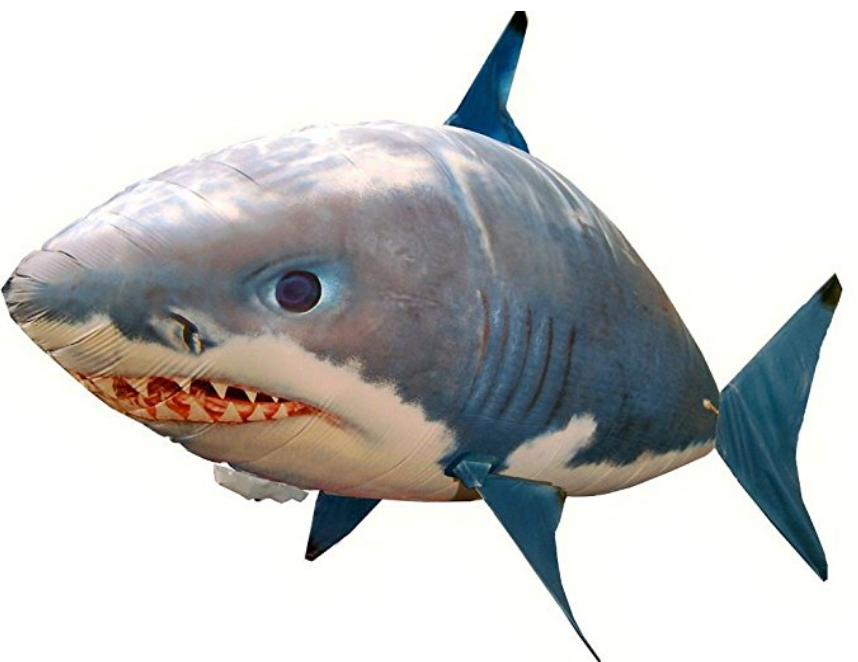
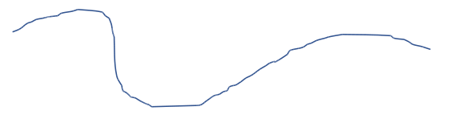

# Blimps

Welcome to the Blimp's GitHub page!

  

## Project Overview

This project is a front end vision and control system than can be deployed on a laptop or a ground station to control a group of autonomous blimps.

  
   
  

## Project Objective:

* Offline Mapping with SfM
* Real-time localization
* Path tracking
* Pose Estimation

## Hardware Setup

1. An [FPV analog camera and a transmitter](https://www.amazon.com/dp/B078GXGYH5/ref=sspa_dk_detail_0?psc=1&pd_rd_i=B078GXGYH5&pf_rd_m=ATVPDKIKX0DER&pf_rd_p=f52e26da-1287-4616-824b-efc564ff75a4&pf_rd_r=PDSQGB7KPVB4F2CVWKHX&pd_rd_wg=TfCln&pf_rd_s=desktop-dp-sims&pf_rd_t=40701&pd_rd_w=P08gC&pf_rd_i=desktop-dp-sims&pd_rd_r=2cd61361-c1a2-11e8-bfb2-a95fb8e0f3b4)

2. A [receiver](https://www.amazon.com/EACHINE-Receiver-Channel-Android-Smartphone/dp/B071VZYLYH/ref=sr_1_2?ie=UTF8&qid=1539615997&sr=8-2&keywords=eachine+rotg01)

3. A [3.8v Lipo battery](https://www.amazon.com/Crazepony-230mAh-Battery-Inductrix-Connector/dp/B01N0Z0ME2/ref=lp_11745091011_1_13?srs=11745091011&ie=UTF8&qid=1538149383&sr=8-13) to power the camera and transmitter

4. Three [Remote Toy Blimps](https://www.amazon.com/Air-Swimmers-Remote-Control-Flying/dp/B005FYEAJ8/ref=sr_1_1?ie=UTF8&qid=1537814028&sr=8-1&keywords=shark+blimp)

5. Four AAA battery will be used to power the blimps and remote controllers

## Software

### Dependencies

* [GTSAM](https://gtsam.org/) 4.0
* [Superpoint](https://github.com/MagicLeapResearch/SuperPointPretrainedNetwork)
  - Superpoint is Downloaded as a Submodule in the repo. Thus you only need to install Superpoint dependencies to run Superpoint.
  - [OpenCV](https://opencv.org/) python >= 3.4
  - [PyTorch](https://pytorch.org/) >= 0.4
* Numpy - standard pythonic module 

### Offline Mapping

The first objective of this project is to use images collected by the analog camera to reconstruct a map through offline structure from motion (SfM).

First we will use `Superpoint` to extract feature points of each image. 

Next we create an empty factor graph for solving SfM.

We then add  `GenericProjectionFactorCal3_S2` factors between pose and landmark variables and back projected the extracted feature points to a certain distance to generate initial estimations for all the landmark variables.

To anchor the map, we will need to add prior for at least seven degree of freedoms (x,y,z,row,pitch,yaw,scalar). Therefore, we can add prior for the first pose and the last pose (or the second pose). These two prior will provide constraint for 6+6=12 degree of freedoms.

We will also need to calculate the average descriptor value for each point in the map and store the descriptor value with the corresponding point in the map. The descriptor value will be used for feature point and landmark data association during localization.

### Real-time Localization

The system will use an input image, a preconstructed map, and the previous trajectory to find the current robot location. 

First we extract feature points from the input images with `Superpoint`.

Next, we project all the points to the camera by estimating the current camera pose with the previous camera pose and filter the points outside the image. 

Then, we match newly extracted feature point with points in the map by comparing the descriptors of the projected landmark points with the descriptor of the extracted feature points and the distance between the projected landmark points and the extracted feature points.

Through the data association process above, we can find the match of feature points with landmarks in the map. We use these matches as factors and add to a new factor graph.

For each landmark in the factor graph, we will add a strongly constraint prior factor.

## Coding Dogma
1. Unittest: https://docs.python.org/3/library/unittest.html
2. We will need to follow the google python style for coding: https://github.com/google/styleguide/blob/gh-pages/pyguide.md
3. Write [doc string](https://www.geeksforgeeks.org/python-docstrings) at the beginning of each script
4. Write doc string for each function including test functions.
5. Write annotation for key steps of a function.
6. Declare the function before you call it.
7. Less Abbreviations
8. The programming paradigm is `functional programming`

## TODO list
- [ ] Blimp control hardware design
- [ ] Blimp control through computer
- [ ] Offline Mapping
- [ ] Realtime Localization
- [ ] Human Pose Detection